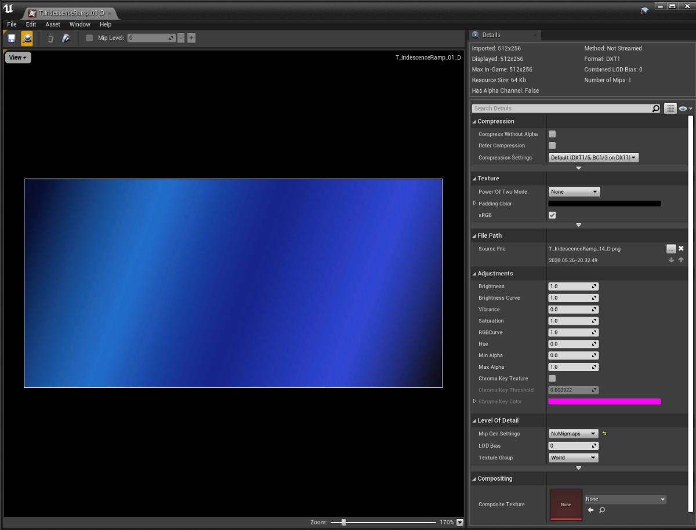
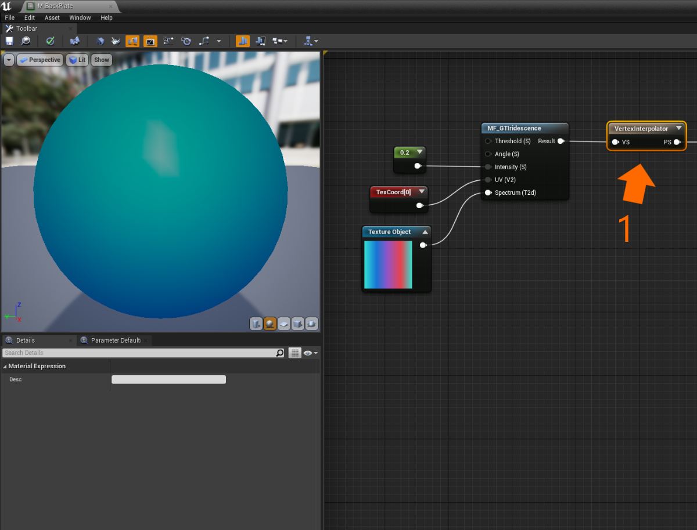
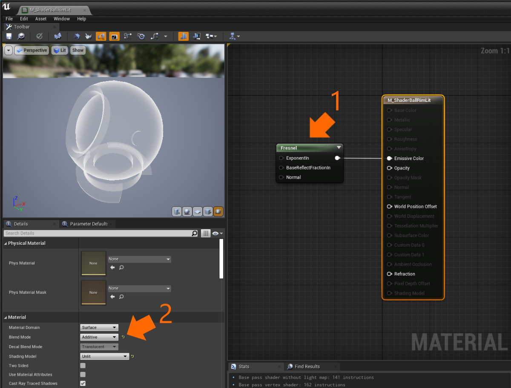
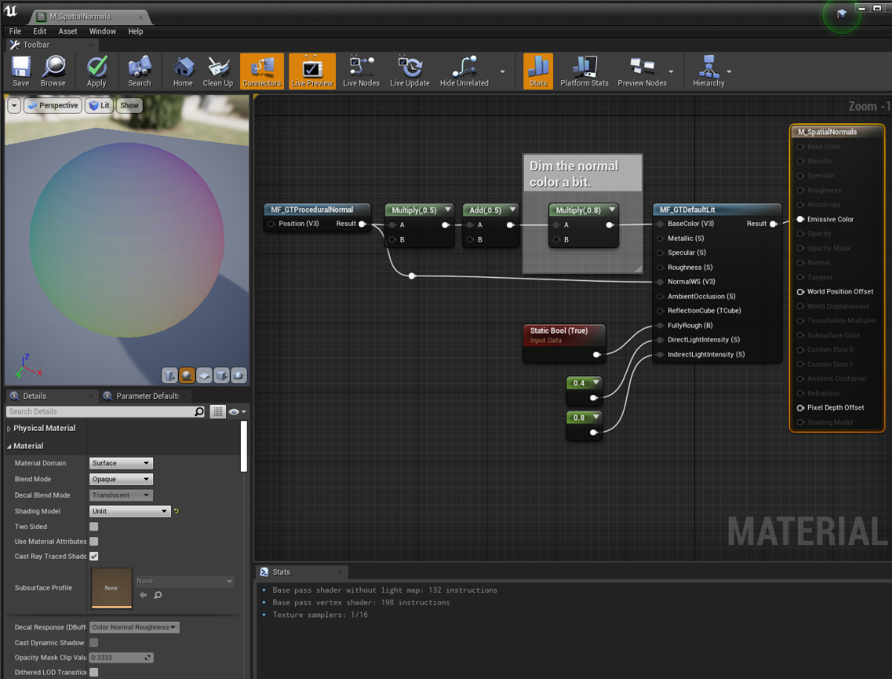
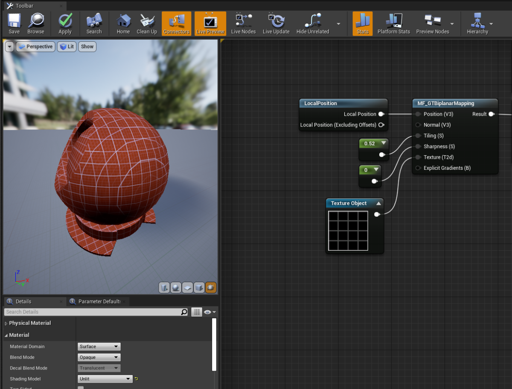

# Effects

Graphics Tools contains a handful of effects that are commonly found in Mixed Reality applications. Effects normally exist as a single [material function](https://docs.unrealengine.com/en-US/RenderingAndGraphics/Materials/Functions/index.html) which can be dropped into a material graph. Expect the library of effects to grow over time with subsequent Graphics Tools releases.

## Iridescence

Iridescence is a visual phenomenon that occurs when a surface gradually changes color when viewed from a different angle (or if lighting angles change). In nature this can be seen on soap bubbles, hummingbird feathers, and on oil slicks. Mixed Reality applications normally apply this effect to UI back plates to provide visual contrast and interest. 

### Example material

Example usage of the `MF_GTIridescence` material function can be found within the `GraphicsToolsProject\Plugins\GraphicsToolsExamples\Content\MaterialGallery\Materials\M_ShaderBallIridescent.uasset` material.

### Implementation details

To apply an approximation of iridescence on any material use the `MF_GTIridescence` material function. The `MF_GTIridescence` material function takes a handful of inputs:

* `Threshold` defines the range when sampling the `Spectrum` texture. (The default value is recommended for most scenarios.)
* `Angle` controls the "roll" of the `Spectrum` texture in `UV` space.
* `Intensity` scales how intense the final effect is.
* `UV` should normally be connected to the first texture coordinate.
* The `Spectrum` input is a texture (`TextureObject`) which defines a color gradient look up table. Below is the spectrum texture used on back plates within the Hololens 2 shell, and can be found at `GraphicsToolsProject\Plugins\GraphicsToolsExamples\Content\Common\Materials\T_IridescenceRamp_01_D.uasset`.
    

To improve performance the `MF_GTIridescence` material function is intended to be invoked in the vertex shader by connecting the output to a `VertexInterpolator` node. (1)

## Rim lighting

Also referred to Fresnel lighting, rim lighting illuminates pixels with normals which face nearly perpendicular to the viewing angle. Many Mixed Reality applications use rim lighting to highlight an object or give the impression of a hologram as seen in "Hollywood movies."

### Example material

An example of rim lighting can be found within the `GraphicsToolsProject\Plugins\GraphicsToolsExamples\Content\MaterialGallery\Materials\M_ShaderBallRimLit.uasset` material.

### Implementation details

To create a rim lit material use Unreal's built in `Fresnel` material node (1) and assign it to the `Emissive Color` of an "Unlit" material. Most rim lit materials are also set to "Additive" (2) so that that brighten anything they render over top of.

> [!NOTE] 
> Translucent materials (such as "Additive" materials) do not write depth values to the scene's depth buffer by default in Unreal. Materials which do not write depth will "distort or swim" when viewed on HoloLens 2 due to the use of the depth based reprojection. More information can be found on within the [reprojection documentation](https://docs.microsoft.com/en-us/windows/mixed-reality/develop/platform-capabilities-and-apis/hologram-stability#reprojection). 

# Procedural Normal

Surface normals are used extensively in computer graphics to determine which way a surface is facing and how light bounces off a surface. Normally surface normals are calculated for a mesh at creation or import time, but with procedural meshes this calculation may not occur. Fortunately, there is a way to automatically generate surface normals in a pixel shader.

> [!NOTE] 
> Procedural normals do not account for [smoothing groups](https://en.wikipedia.org/wiki/Smoothing_group) and may make a model appear faceted. 

### Example material

Example usage of the `MF_GTProceduralNormal` material function can be found within the `GraphicsToolsProject\Plugins\GraphicsToolsExamples\Content\SpatialPerception\Materials\M_SpatialNormals.uasset` material.

### Implementation details

To use procedural normals on any material use the `MF_GTProceduralNormal` material function. The `MF_GTProceduralNormal` material function takes a position that is interpolated across a triangle face, defaulting to a pixel's world space position, and returns a surface normal. The surface normal is calculated by taking the cross product of the the [partial derivatives](https://docs.microsoft.com/en-us/windows/win32/direct3dhlsl/dx-graphics-hlsl-ddx) of the pixel position with respect to the screen-space horizontal and vertical coordinates. In other words, the cross product between two vectors representing the horizontal and vertical delta position between neighboring pixels.

An example material graph of procedural normal calculation turned into a color can be seen below:

# Biplanar Mapping

Biplanar mapping is a technique that projects a texture map onto a 3D surface based on vertex positions and normals. Textures are normally mapped onto a 3D surface using texture coordinates (or UVs) but occasionally a mesh does not contain texture coordinates or it is desirable to procedurally generate texture coordinates based on a the position of a mesh. This effect is commonly used for terrain or a [spatial mesh](SpatialPerception.md). 

Biplanar mapping is a procedural texturing technique, like [triplanar mapping](https://bgolus.medium.com/normal-mapping-for-a-triplanar-shader-10bf39dca05a), but uses only two texture samples rather than three for improved performance on Mixed Reality devices. Please see [Inigo Quilez's article](https://www.iquilezles.org/www/articles/biplanar/biplanar.htm) to learn more.

### Example material

Example usage of the `MF_GTBiplanarMapping` material function can be found within the `GraphicsToolsProject\Plugins\GraphicsToolsExamples\Content\MaterialGallery\Materials\M_ShaderBallBiplanarMapping.uasset` material.

### Implementation details

To use biplanar mapping on any material use the `MF_GTBiplanarMapping` material function. The `MF_GTBiplanarMapping` material function takes a handful of inputs and returns a pixel color sampled from the input texture:

* `Position` a position that is interpolated across a triangle face. Normally a world or local space position. When using world space positions a texture will tile seamlessly across actors. Defaults to a pixel's world space position.
* `Normal` a surface normal that is interpolated across a triangle face. Normally a world or local space normal. Defaults to a pixel's world space normal.
* `Tiling` how often to tile a texture per Unreal unit. For example 10 will tile a texture 10 times per unit.
* `Sharpness` controls the blend sharpness where two projection planes meet.
* `Texture` The texture to sample during biplanar mapping. Textures which tile normally look best.
* `Explicit Gradients` when set to false the bilinear mapper will produce one-pixel wide line artifacts, setting this to true fixes the issue at the expense of extra instructions. It is recommended to normally set this to true, and false in performance critical situations.

An example material graph of local space biplanar mapping can be seen below:

## See also

- [Lighting](Lighting.md)
- [Spatial Perception](SpatialPerception.md)
