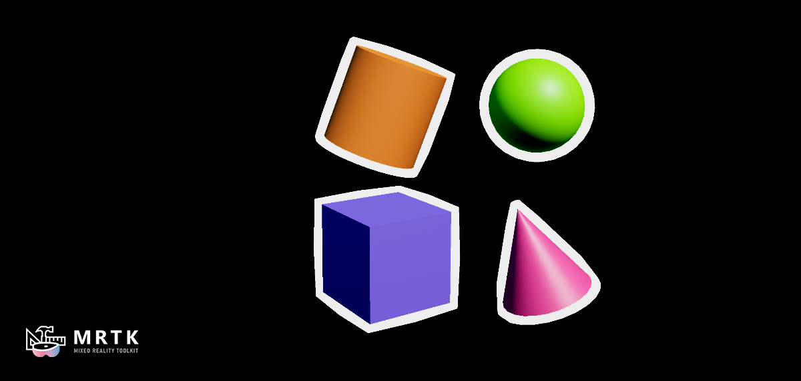
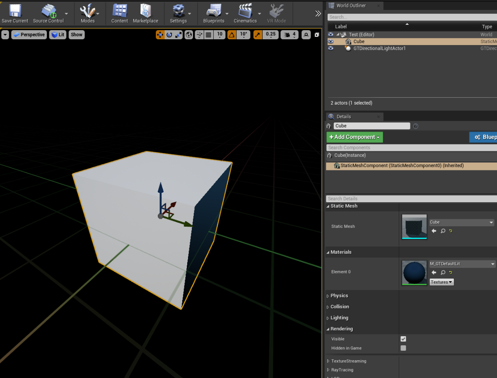
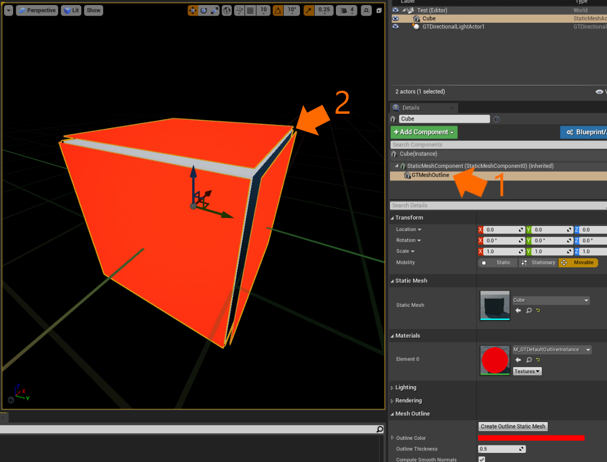
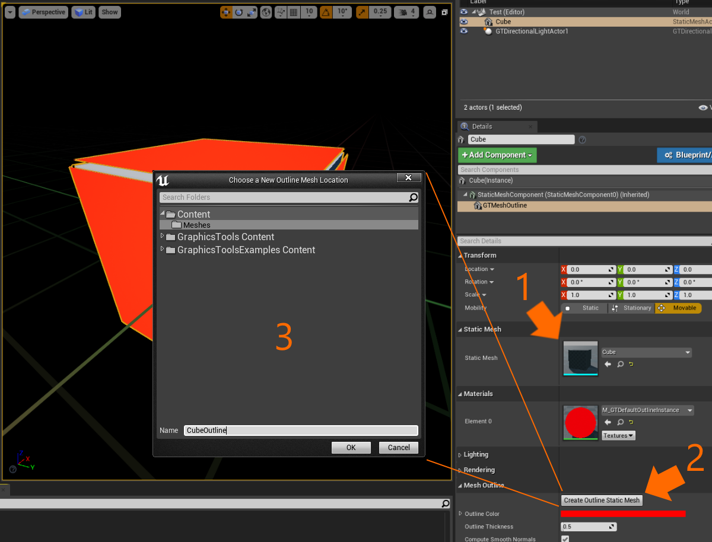
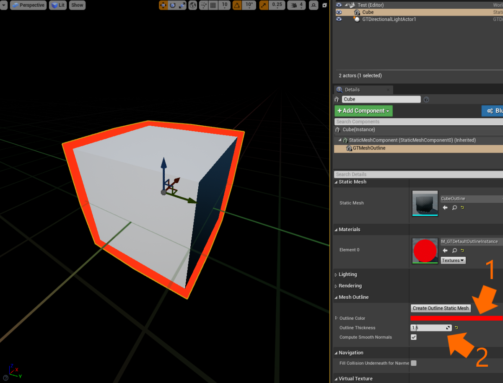
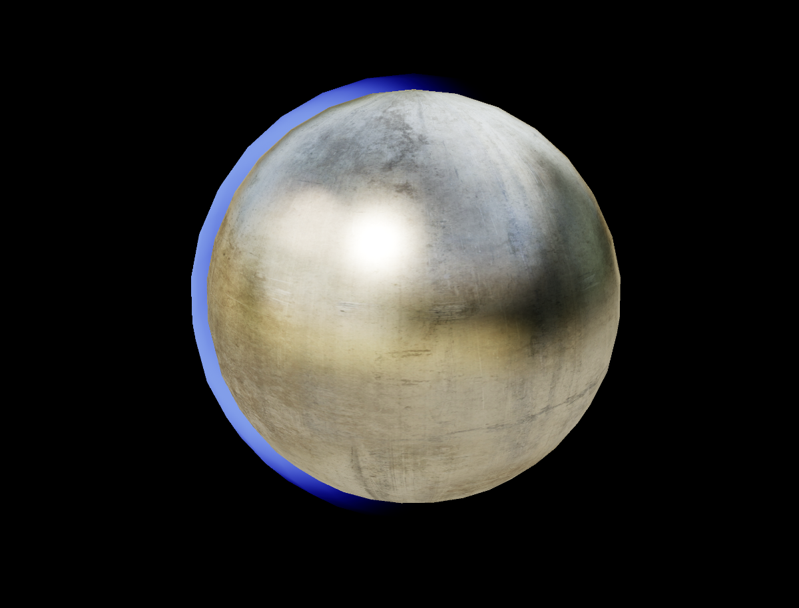
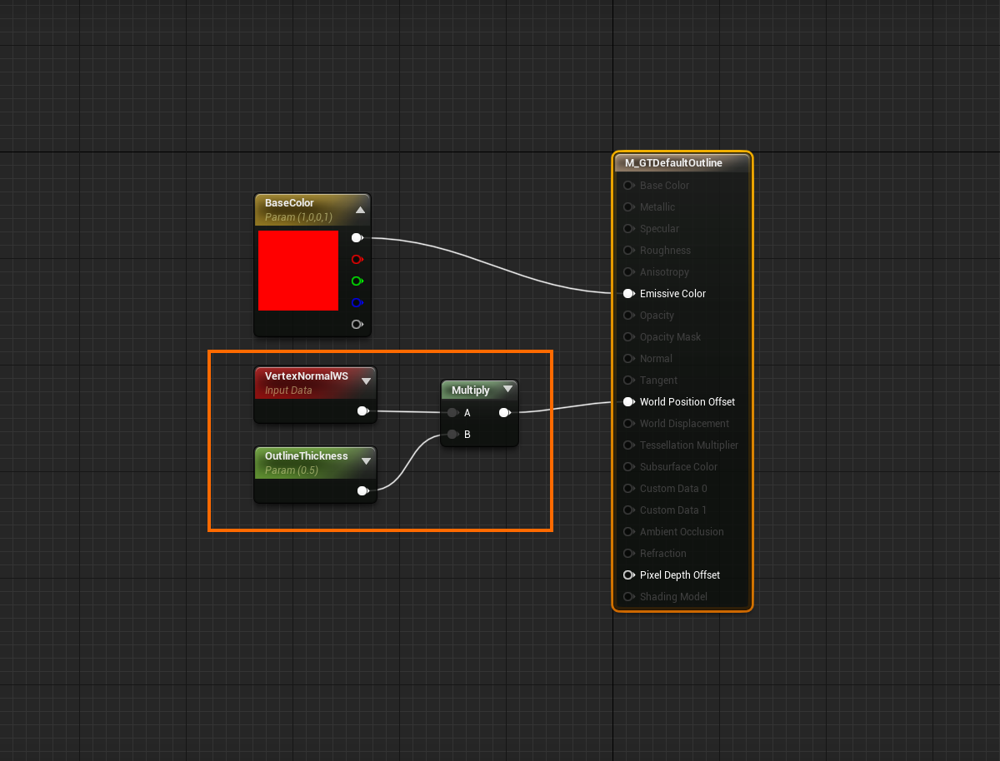

# Mesh outlines

Outlines, sometimes referred to as stroke or silhouette effect, are a common design pattern to demonstrate when an object is selected or to draw attention to an object. Many modern mesh outline techniques are done using [post processing](https://docs.unrealengine.com/4.26/en-US/RenderingAndGraphics/PostProcessEffects/) effects. Post processing provides flexible and great quality outlines but can be prohibitively expensive on mobile mixed reality devices. To avoid performance issues, we can rely on methods used in video games of the past, such as an "inverted hull" method.

The inverted hull method requires that the object being outlined is rendered twice, but for most meshes this is cheaper than introducing an entire post processing pipeline. An outlined mesh is first rendered normally, then it is rendered a second time flipped inside out and slightly larger. Normally a shader will dynamically make the mesh larger by extruding vertices along a vertex normal. Graphics Tools has the `GTMeshOutline` component and `M_GTDefaultOutline` material to help with rendering a mesh outline and with outline mesh preparation. Details on how to use these components can be found in the [example usage](#Example-usage) section.

Note, the inverted hull technique has a few caveats that are worth mentioning before continuing:

* The outline mesh must be watertight hull (and not double sided) else you may see split edges, holes, or other artifacts. (Graphics Tools contains a process to help generate outline meshes.)
* Mesh concavities can intersect each other when the outline is thick. This is due to a limitation in the Unreal renderer for controlling sort order and depth writes of opaque materials.
* Outlines will not render though occluding objects.
* Translucent objects may show the outline mesh in areas you would expect to be occluded.

## Example level

There are some demonstrations of mesh outlines within the `\GraphicsToolsProject\Plugins\GraphicsToolsExamples\Content\MeshOutlines\MeshOutlines.umap` level.

## Example usage

In the following steps we will create a static mesh in a level and have it outlined.

1. First let's add a cube to an empty level.
    * Create a new level (File > New Level) and select "Empty Level."
    * From the "Place Actors" panel drop a Cube actor into the level.
    * It's good practice to keep our materials simple (in other words keep the number of shader instructions low) when authoring materials for mixed reality. With the Cube actor selected change the material to the `M_GTDefaultLit` material.
    * Our Cube may look a little dark. That's because we need a light to illuminate it. From the "Place Actors" panel drop a `GTDirectionalLight` actor into the level. 
    * Set the `GTDirectionalLight`'s "Intensity" to 2. The default value represents a "sunny day" and may wash out our material.
    * Lastly scale the Cube down so that it is a acceptable size for mixed reality. A uniform scale of 0.2 is a good scale to try.

    
    
2. Next we are going to add a `GTMeshOutline` component to our Cube.
    * Add a `GTMeshOutline` component as a child of the Cube's `StaticMesh` component (1). Note, we are adding the component as a child of the static mesh since we will want the outline component to remain fixed to the static mesh, in other words translate, rotate, and scale whenever the mesh is transformed.
    * You will notice immediately that the `GTMeshOutline` component has a `Cube` static mesh and `M_GTDefaultOutline` material, but the outline doesn't look correct. There are obvious discontinuities in the outline (2) and it occludes the Cube. To fix this we need to make an "outline mesh" that represents a cube. We will do this in the next step.

    

2. Normally you would generate an outline mesh in a digital content creation tool outside of Unreal. This would entail flipping the normals of the mesh and smoothing any vertex normals that would cause discontinuities, or holes, to open in the mesh when it is extruded along the surface normal. Not all of us are skilled artists, so fortunately for us Graphics Tools contains tooling to generate an outline mesh automatically.
    * Select the `GTMeshOutline` component and ensure that the same mesh used by the parent `StaticMesh` component is specified in the `GTMeshOutline` component's static mesh (1). Normally this is populated automatically for you.
    * Next scroll down to the "Mesh Outline" properties and select "Create Outline Static Mesh" (2).
    * Choose a project directory to save the outline mesh to, and optionally a name, and click "OK" (3). If the process is successful a new `CubeOutline` mesh will be generated and automatically applied to the `GTMeshOutline` component's static mesh.

    

4. You cube should now have a red outline around your cube.
    * You can modify the color of the outline by adjusting the `Outline Color` property (1).
    * You may also modify the thickness of the outline, in Unreal units, by adjusting the `Outline Thickness` property (2). Try bumping the thickness up to "1.5"
     as seen in the image below. It is up to the material to decide how to use this value, but in the case of the `M_GTDefaultOutline` material it is used to determine the distance to offset the vertex position along the vertex normal.

    

You now have a cube that is outlined using the `GTMeshOutline` component. You can enable and disable rendering of the outline just like any other static mesh component. Or try animating the outline thickness and color in a blueprint or C++.

## Advanced usage

Outlines can be represented by more than a solid unlit color. Because an outline has a unique material, it can take advantage of almost any effect available to the material graph. The below image is an example of using the `GTMeshOutline` component with a custom additive material that strobes light across the outline. 

When creating custom material outlines make sure to extrude the mesh's vertices with the "World Position Offset." If the outline mesh is not extruded it will be completely occluded by the normal static mesh. Vertex extrusion is done by scaling the world space vertex normal by the `Outline Thickness` parameter and sending that value into the "World Position Offset." An example of this is in the below material graph:

    
## See also

- [Lighting](Lighting.md)
- [Effects](Effects.md)
