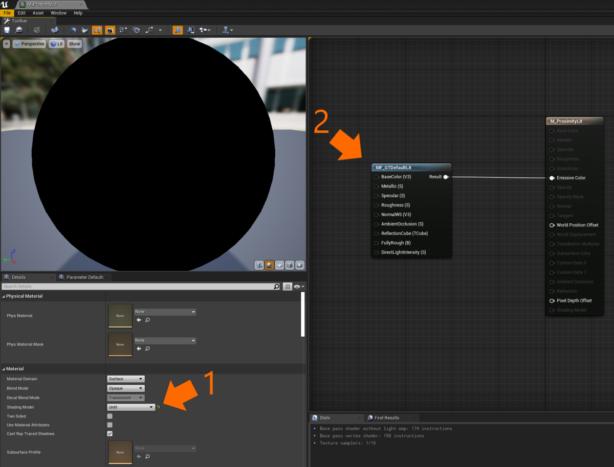

# Mesh outlines

Outlines, sometimes referred to as stroke or silhouette effects, are a common design pattern to demonstrate when an object is selected or to draw attention to an object. Many modern mesh outline techniques are done using [post processing](https://docs.unrealengine.com/4.26/en-US/RenderingAndGraphics/PostProcessEffects/) techniques. Post processing provides flexible and great quality outlines, but can be prohibitively expensive on mobile mixed reality devices. To avoid performance issues we can rely on methods used in video games of the past, such as an "inverted hull" method.

The inverted hull technique requires that the object being outlined is rendered twice, but for most meshes this is cheaper than introducing an entire post processing pipeline. An outlined mesh is first rendered normally, then it is rendered a second time flipped inside out and slightly larger. Normally a shader will dynamically make the mesh larger by extruding vertices along a vertex normal. Graphics Tools has the `GTMeshOutline` component and `M_GTDefaultOutline` material to help with rendering a mesh outline and with outline mesh preparation. Details on how to use these components can be found in the [example usage](#Example-usage) section.

Note, the inverted hull technique has a few caveats that are worth mentioning before continuing:

* The outline mesh must be watertight hull (and not double sided) else you may see split edges, holes, or other artifacts. (Graphics Tools contains a process to help generate outline meshes.)
* Mesh concavities can intersect each other when the outline is thick.
* Outlines will not render though occluding objects.
* Translucent objects may show the outline mesh in areas you would expect to be occluded.

## Example level

There are some demonstrations of mesh outlines within the `\GraphicsToolsProject\Plugins\GraphicsToolsExamples\Content\MeshOutlines\MeshOutlines.umap` level.

## Example usage

In the following steps we will create place a static mesh in a level and have it outlined.

1. First we will create a material. TODO
    * Right click within the "Content Browser" and select "Material" under the "Create Basic Asset" menu listings. 
    * Let's name our material `M_ProximityLit`. 
    * Double click on `M_ProximityLit` to open the material editor. 

2. It's good practice to keep your materials simple (in other words keep the number of shader instructions low) when authoring materials for Mixed Reality. 
    * To ensure this, mark `M_ProximityLit` as "Unlit" (1) in the material's "Shading Model" property. 
    * (Optional) If you would like your material to still look as though it is lit, then right click on the material graph and add the `MF_GTDefaultLit` material function. Connect the result of the `MF_GTDefaultLit` to the material's "Emissive Color." (2)

    

## Advanced usage

TODO

1) TODO
    * TODO
    * TODO
    
## See also

- [Lighting](Lighting.md)
- [Effects](Effects.md)
