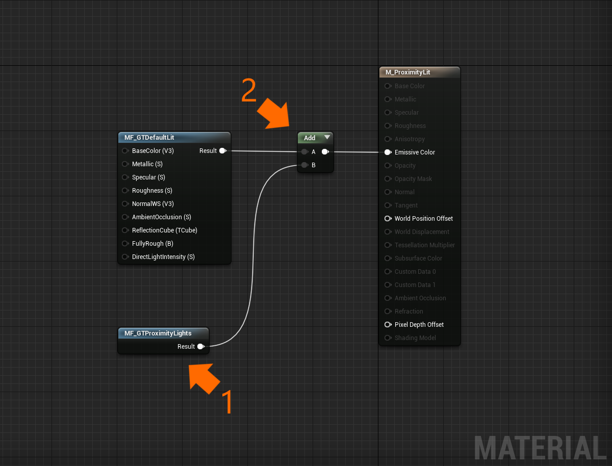
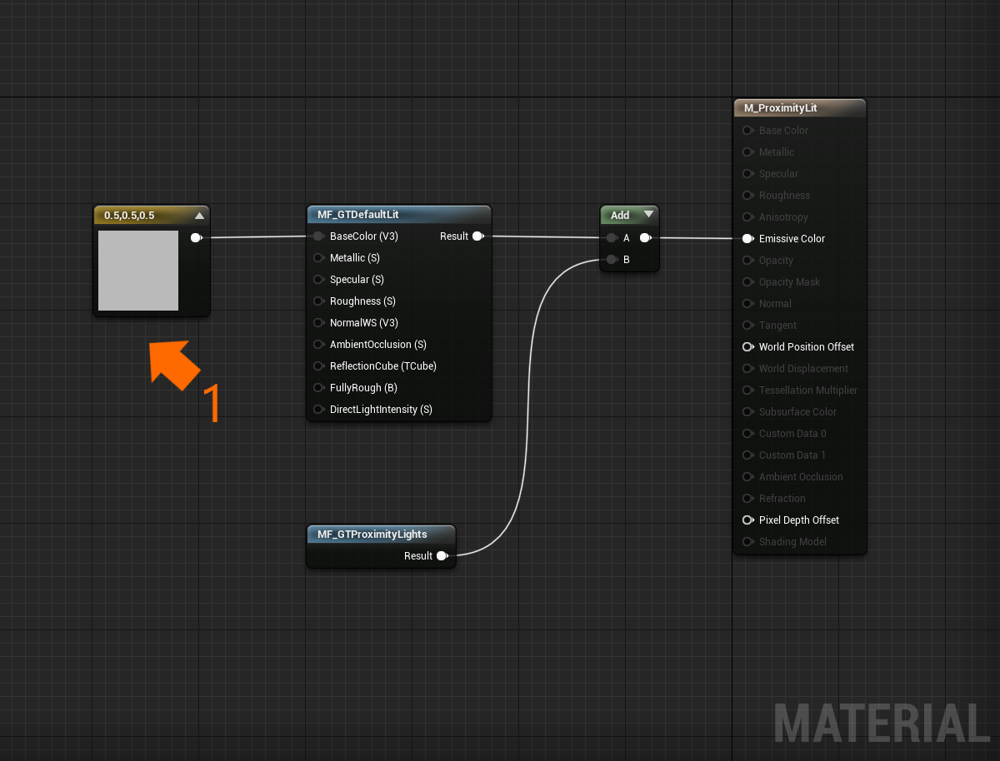

# Proximity Lights

A proximity light is a [Fluent Design System](https://www.microsoft.com/design/fluent) paradigm that mimics a [point light](https://docs.unrealengine.com/en-US/BuildingWorlds/LightingAndShadows/LightTypes/Point/index.html) projected onto a surface with a color gradient. Often used for near interactions, an app can control the location and properties of a proximity light via the `GTProximityLight` component (or actor). To utilize proximity lights on a [material](https://docs.unrealengine.com/en-US/RenderingAndGraphics/Materials/index.html), place the `MF_GTProximityLights` [material function](https://docs.unrealengine.com/en-US/RenderingAndGraphics/Materials/Functions/index.html) within a material and assign the output to the material's emissive color.

> [!NOTE] 
> Up to three proximity lights can effect a material at once. Additional proximity lights will not be included in light calculations by default. To add additional proximity lights please see the [advanced usage](#Advanced-usage) section.

Another unique feature of proximity lights is that they can pulse to draw attention. To pulse a proximity light call the `Pulse` member function via Blueprint or C++. 

## Example level

There are some demonstrations of proximity lights within the `\GraphicsToolsProject\Plugins\GraphicsToolsExamples\Content\ProximityLights\ProximityLights.umap` level.

## Example usage

In the following steps we will create a new material that is illuminated by a proximity light.

1. First we will create a material.
    * Right click within the "Content Browser" and select "Material" under the "Create Basic Asset" menu listings. 
    * Let's name our material `M_ProximityLit`. 
    * Double click on `M_ProximityLit` to open the material editor. 

2. It's good practice to keep your materials simple (in other words keep the number of shader instructions low) when authoring materials for Mixed Reality. 
    * To ensure this, mark `M_ProximityLit` as "Unlit" (1) in the material's "Shading Model" property. 
    * (Optional) If you would like your material to still look as though it is lit, then right click on the material graph and add the `MF_GTDefaultLit` material function. Connect the result of the `MF_GTDefaultLit` to the material's "Emissive Color." (2)

    

3. Our material now needs to add proximity light calculations. 
    * To do this right click on the material graph and add the `MF_GTProximityLights` material function (1). 
    * Connect the result of `MF_GTProximityLights` to the material's "Emissive Color." If your material is also using the `MF_GTDefaultLit` material function (from step 2) then add the result from both functions before connecting the result to the material's "Emissive Color." (2) Don't worry about the inputs to `MF_GTProximityLights` because they are auto-populated. To learn more see the [advanced usage](#Advanced-usage) section.

    

4. Next let's give our material a base color. Very few materials exist in the real world are completely black (and completely black materials render transparently on additive displays like the one found on HoloLens 2). 
    * Right click on the material graph and add a `ConstantVector3` node. 
    * Set the node's RGB channels to 0.5, a neutral gray color. 
    * Connect this node to the `BaseColor` input of the `MF_GTDefaultLit` material function. (1) Or, add to the `MF_GTProximityLights` output if you opted not to use the `MF_GTDefaultLit` function in step 2.

    

5. It's time to preview our material interacting with a proximity light. 
    * First let's create a new level (File > New Level) and select "Empty Level." 
    * From the "Place Actors" panel drop a `Sphere` actor into the level. 
    * With the `Sphere` actor selected change the material to our newly created material, `M_ProximityLit`. 
    * (Optional) Scale the sphere down to about 25% so that it's not so large.

    

6. You may notice now that our `Sphere` actor is completely black and can't be differentiated from the background. To fix this let's add a directional light to our scene. Because we are using the `MF_GTDefaultLit` material function we must use a `GTDirectionalLight` actor (or component). 
    * From the "Place Actors" panel drop a `GTDirectionalLight` actor into the level. 
    * Set the `GTDirectionalLight`'s "Intensity" to 2. The default value represents a "sunny day" and may wash out our proximity light. More information about the `GTDirectionalLight` component can be found in the [lighting](Lighting.md) documentation.

7. Finally it's time to add a proximity light to the level. 
    * From the "Place Actors" panel drop a `GTProximityLight` actor into the level. 
    * Move the `GTProximityLight` actor around until it hovers near the surface of the the `Sphere` actor. You will now see the proximity light illuminate the surface with a blue-purple gradient. (1) 
    * Try experimenting with different proximity light colors by changing the center, middle, and outer colors in the details panel of the proximity light. Or, try changing the size of proximity light via projected radius. 
    * If you want to hide the proximity light without removing the actor you can uncheck the "Visible" flag under the "Rendering" properties.

    

## Advanced usage

By default only three proximity lights can illuminate a material at a time. If your project requires additional proximity lights to influence a material the steps below demonstrates how to achieve this.

> [!NOTE]
> Having many proximity lights illuminate a material will increase pixel shader instructions and will impact performance. Please profile these changes within your project.

*How to increase the number of proximity lights which effect a surface from three to six.*

By default Graphics Tools will automatically send the proximity lighting state to materials via a material parameter collection up to the three light limit. As a developer you can pipe this data into materials yourself with a material parameter collection override.

1) Create a material that accepts proximity lighting as outlined in the [advanced usage](#Example-usage) section above. 
    * Place six proximity lights in a level that are near a surface that uses the material you just created.
    * Note that only three lights illuminate the surface.

2) Our material needs a mechanism to know about the 3 extra proximity lights. We will use a material parameter collection to do this.
    * Right click within the "Content Browser" and select "Material Parameter Collection" under the "Create Advanced Asset/Materials and Textures" menu listings.
    * Let's name our material parameter collection `MPC_ExtraProximityLights`.
    * Double click on `MPC_ExtraProximityLights` to open the material parameter collection editor.
    * Add 18 vector parameters (1), six for each proximity light, that have a default value of black (0, 0, 0, 0). 
    * Name the parameters to match the parameter names found under the advanced tab of the proximity light. (2) You are free to change these names to whatever you want if they are unique and match between the proximity light and material parameter collection.
    * Finally, assign `MPC_ExtraProximityLights` to the "Parameter Collection Override" property of the three additional proximity lights. (3)

    

3) Next we will augment our material to calculate the three new proximity lights.
    * To do this right click on the material graph and add a second `MF_GTProximityLights` material function (1).
    * This time we will manually specify the inputs from from the `MPC_ExtraProximityLights` material parameter collection. Connect each input of the `MF_GTProximityLights`function with the corresponding `MPC_ExtraProximityLights` parameter. (2) Do this for all 18 inputs.
    * Lastly, add the result of the two `MF_GTProximityLights` functions before adding to the `MF_GTDefaultLit` function. (3)

    

Out material will now perform lighting calculations for the three default proximity lights as well as our three extra proximity lights. 
    
## See also

- [Lighting](Lighting.md)
- [Effects](Effects.md)
