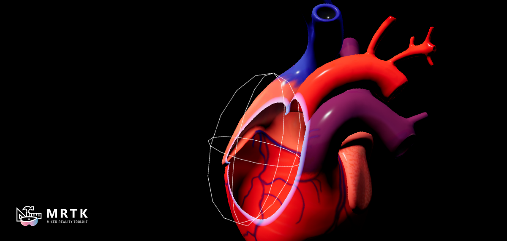
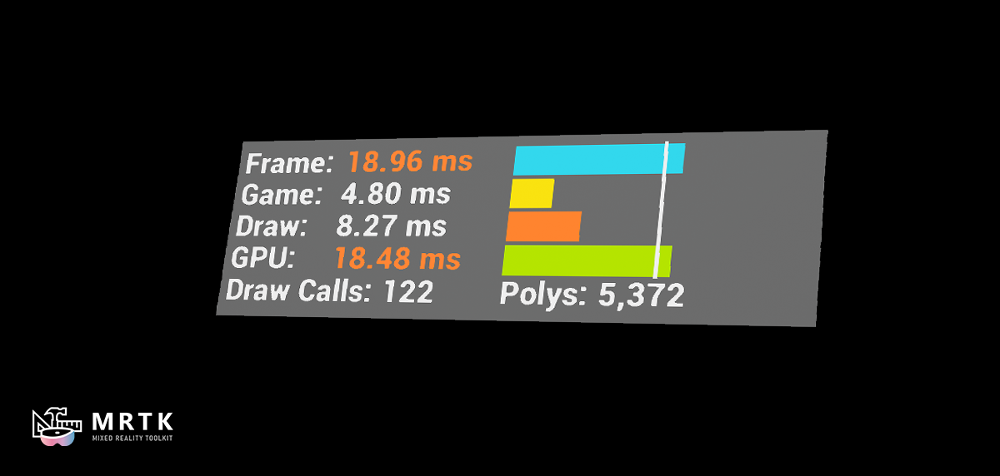

# Graphics Tools 0.2.0 release notes

- [What's New](#whats-new)
- [Breaking Changes](#breaking-changes)
- [Known Issues](#known-issues)

The second release of the Graphics Tools supports only HoloLens 2, but many material/shader techniques should work on other platforms. Support for other MR platforms remains a goal for us but is not the current focus. Please see the [README](../README.md#graphics-building-blocks) page for a list of all features and building blocks.

Unreal 4.26.x required.

## What's new

### Clipping Primitives

Tools to dynamically slice away a mesh and peer inside the geometry

### Profiling

Explore profiling techniques and tools useful for Mixed Reality development

### Spatial Perception

Techniques that create visually compelling materials for real world geometry

### Support for arbitrary proximity light counts

Added documentation and examples to go above the three proximity light limit. See the [proximity lights](ProximityLights.md#Advanced-usage) and `GTSceneComponent` for additional information.

### Direct and indirect light scalar

Added two new scalar inputs to the `MF_GTDefaultLit` material function named `DirectLightIntensity` and `IndirectLightIntensity` to provide finer grained control over material lighting.

## Breaking changes

### Fully rough materials may appear a bit darker

This can be adjusted by altering the value of the `IndirectLightIntensity` to a value of ~0.9.

### The `GTLightComponent` now derives from the `GTSceneComponent` rather than the `SceneComponent`

This change allows all lights to have a material property collection override. 

## Known issues

### Crash when exiting the Spatial Perception example level on HoloLens 2

This is a know engine issue in 4.26.1. A fix is slated for the next release of the engine.

### Translucent material reprojection

Translucent materials located with the examples plugin may "wobble or smear" on HoloLens 2 because translucent materials do not write depth. Depth is required for all materials to reproject correctly because HoloLens 2 uses [depth based late stage reprojection](https://docs.microsoft.com/en-us/windows/mixed-reality/develop/platform-capabilities-and-apis/hologram-stability#reprojection).

If you run into issues caused by Graphics Tools or have questions about how to do something, please [file an issue](https://github.com/microsoft/MixedReality-GraphicsTools-Unreal/issues/new) on the GitHub repo.
