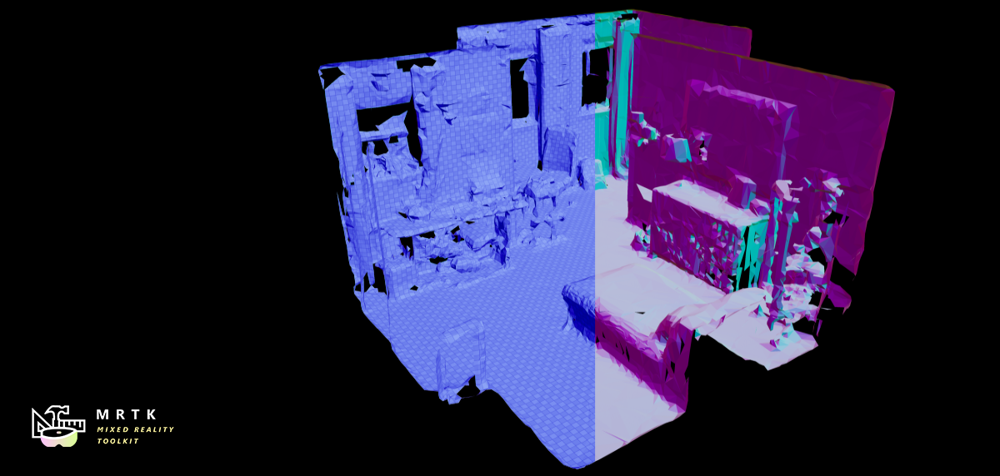
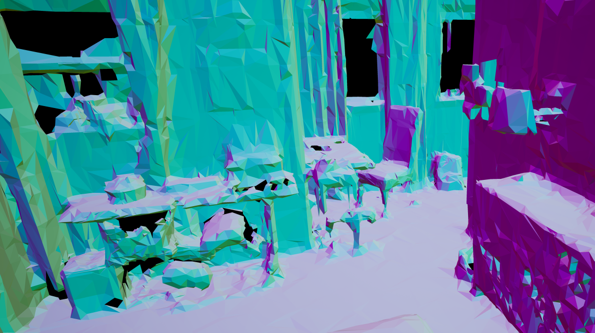

# Spatial Perception

Mixed Reality devices can generate meshes of the real world via a unique blend of hardware and software. Unlike traditional geometry these meshes only contain vertex positions and not other vertex attributes like normals and texture coordinates. Without vertex normals and texture coordinates it can be difficult to create visually compelling materials. Below we demonstrates a few techniques to help solve this issue.

## Example level

To try all of the materials outlined below run the `\GraphicsToolsProject\Plugins\GraphicsToolsExamples\Content\SpatialPerception\SpatialPerception.umap` level.

## Implementation details and restrictions

The `ARTrackableNotify` actor component is used to subscribe to any events which add, update, and remove spatial meshes. Spatial meshes are geometric surfaces which come from surfaces such as a wall, table, or even your hands. Because these meshes get regenerated in real time, they normally don’t contain vertex normals or texture coordinates which are needed for even the most basic effects. To solve this issue, we can try a few different techniques.

### Wireframe Spatial Mesh

The `GraphicsToolsProject\Plugins\GraphicsToolsExamples\Content\Common\Materials\M_Wireframe.uasset` material demonstrates a simple wireframe reconstruction of a mesh. The wireframe material uses a special material checkbox that is available in all Unreal materials. Note, only the wire color can be controlled. If you app needs to render a color for the triangle faces it will need to render the mesh a second time with a different material.

### Surface Normal Spatial Mesh

The `GraphicsToolsProject\Plugins\GraphicsToolsExamples\Content\SpatialPerception\Materials\M_SpatialNormals.uasset` material shows how to procedurally generate a surface normal and translate the normal vector into a color. Please see [procedural normals](Effects.md#Procedural-Normal) for more information about normal generation.

### Textured Spatial Mesh

The `GraphicsToolsProject\Plugins\GraphicsToolsExamples\Content\SpatialPerception\Materials\M_SpatialCheckerLit.uasset` material demonstrates how to procedurally generate a surface normal and texture coordinate to sample a texture. With normals and texture coordinates generated it's possible to texture and light a spatial mesh. Please see [biplanar mapping](Effects.md#Biplanar-Mapping) for more information about texture coordinate generation.

## See also

- [Effects](Effects.md)
