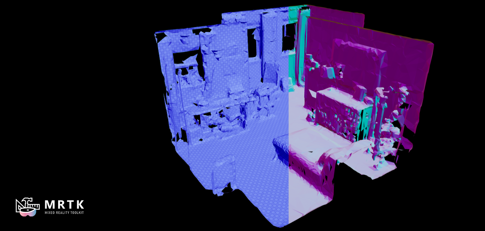

# Spatial Perception

Mixed Reality devices can generate meshes of the real world via a unique blend of hardware and software. Unlike traditional geometry these meshes only contain vertex positions and not other attributes like vertex normals and texture coordinates. Without vertex normals and texture coordinates it can be difficult to create visually compelling materials. Below we demonstrates a few techniques to help solve this issue.

TODO

## Example level

To better understand materials suited for spatial perception look at the `\GraphicsToolsProject\Plugins\GraphicsToolsExamples\Content\SpatialPerception\SpatialPerception.umap` level.

## Implementation details and restrictions

TODO

## See also

- [Effects](Effects.md)
