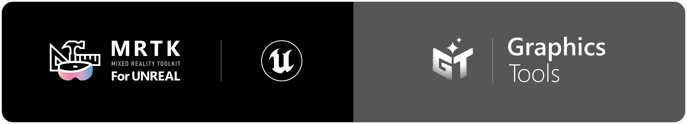
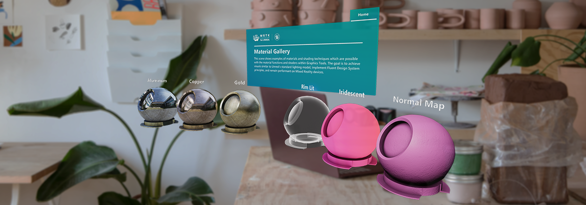

# What is Graphics Tools?

Graphics Tools for Unreal Engine is a UE game plugin with code, blueprints and example assets created to help improve the visual fidelity of Mixed Reality applications while staying within performance budgets.

| NOTE: Only HoloLens 2 development is supported at the moment. |
| --- |

# Getting started with Graphics Tools

If you're new to MRTK or Mixed Reality development in Unreal, **we recommend starting at the beginning of our** [Unreal development journey](https://docs.microsoft.com/windows/mixed-reality/unreal-development-overview) in the Microsoft Docs. The Unreal development journey is specifically tailored to walk new developers through the installation, core concepts, and usage of Graphics Tools.

| CAUTION: The Unreal development journey currently uses **Graphics Tools 0.1.x** and **Unreal 4.26.0+**. |
| --- |

If you're already familiar with Mixed Reality development in Unreal, you can find the installation instructions for the Graphics Tools plugin [here](Docs/Installation.md).

# Required Software

 |    [Windows SDK 18362+](https://developer.microsoft.com/windows/downloads/windows-10-sdk)|    [Unreal 4.26.0+](https://www.unrealengine.com/get-now)|    [Visual Studio 2019](http://dev.windows.com/downloads)|
| :--- | :--- | :--- |
| To build apps with MRTK-Unreal and Graphics Tools, you need the Windows 10 May 2019 Update SDK | The Unreal Engine provides support for building Mixed Reality projects in Windows 10 | Visual Studio is used for code editing |

# Graphics Building Blocks

|  [Lighting](Docs/Lighting.md) |  [Proximity Lights](Docs/ProximityLights.md) |  [Effects](Docs/Effects.md) |
|:--- | :--- | :--- |
| Physically based lighting technique optimized for Mixed Reality | A custom light type used to demonstrate distance to surface | Common graphics effects utilized in Mixed Reality |

# Example Levels

If you want to explore the different Graphics Tools features or want a reference for how to use them, we recommend having a look at the example levels contained in the _Graphics Tools Examples_ plugin (/GraphicsToolsProject/Plugins/GraphicsToolsExamples). You can copy the examples plugin (along with the GraphicsTools plugin) into 'Plugins' subfolder of your own project or you can simply try out the _Graphics Tools Project_ (/GraphicsToolsProject) in this repository. For that you should:

1. [Clone](https://help.github.com/en/desktop/contributing-to-projects/cloning-a-repository-from-github-to-github-desktop) this repository.
1. [Checkout](https://help.github.com/en/desktop/contributing-to-projects/switching-between-branches) the latest 'public/_version_.x' branch.
    * Bear in mind that this branch is alive. It's not a release, and will be **updated regularly with potentially breaking changes**. There will be a release tag (e.g. _release/0.10.0_) marked as such in GitHub.

You can now open the _Graphics Tools Project_ (/GraphicsToolsProject) and explore individual example levels or open the _Loader_ level to access some of the examples from a centralized hub. You can also copy the examples (/GraphicsToolsProject/Plugins/GraphicsToolsExamples) into the 'Plugins' folder in your own project and use the pre-made elements as a base for your own Mixed Reality experience.

Please note that the example content might change significantly between releases. Please make sure to always run the examples with a matching version of the Graphics Tools Plugin as there might be breaking changes in the example code.

# Packaged Graphics Tools Project

We also provide the _Graphics Tools Project_ (/GraphicsToolsProject) pre-packaged for HoloLens 2 so you can try out the main features directly on device easily. To use it:

1. Obtain the packaged game from the latest release page (e.g. _GTProject-HoloLens.0.10.0.zip_) and unzip it to a local directory.
1. Install it in the device via the [Device Portal](https://docs.microsoft.com/en-us/windows/uwp/debug-test-perf/device-portal#install-sideload-an-app).

# Feedback and Contributions

This project welcomes contributions and suggestions.  Most contributions require you to agree to a
Contributor License Agreement (CLA) declaring that you have the right to, and actually do, grant us
the rights to use your contribution. For details, visit https://cla.opensource.microsoft.com.

When you submit a pull request, a CLA bot will automatically determine whether you need to provide
a CLA and decorate the PR appropriately (e.g., status check, comment). Simply follow the instructions
provided by the bot. You will only need to do this once across all repos using our CLA.

This project has adopted the [Microsoft Open Source Code of Conduct](https://opensource.microsoft.com/codeofconduct/).
For more information see the [Code of Conduct FAQ](https://opensource.microsoft.com/codeofconduct/faq/) or
contact [opencode@microsoft.com](mailto:opencode@microsoft.com) with any additional questions or comments.
